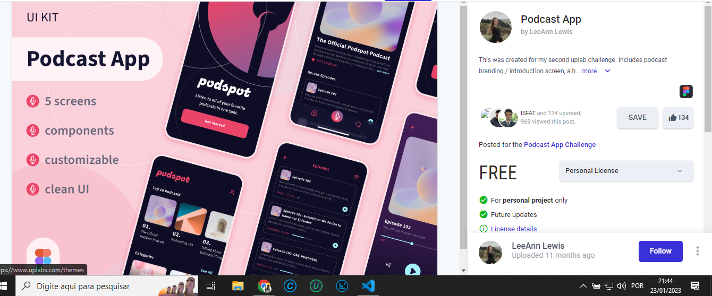
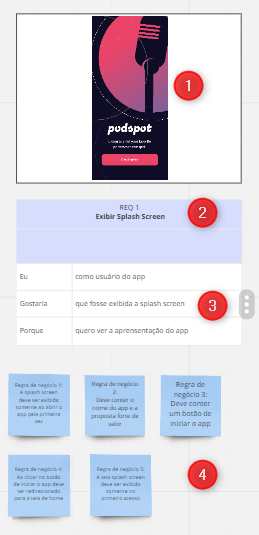

## Projeto Podcast APP

Este projeto foi criado com o propósito de práticar **levantamento de requisito** de um projeto, onde foi levado em consideração analisar um projeto do tipo Figma retirado do site UpsLabs onde vários designer tem a possibilidade de subir os seus projetos. Com isso irei demostrar a análise do projeto PodcastApp onde através do protótipo irei analisar os requisitos desejaveis para este projeto.

## Protótipo

- Protótipo do Figma [PodcastApp](https://www.uplabs.com/posts/podcast-app-27e7dba2-b5d6-40f8-be0f-52d6710b9af7)

## Análise do Projeto

A imagem a baico irá indicaar como foi feita a análise deste projeto, onde foi utilixado o **MIRO** para fazer a análose de forma visual

1. Indicação da imagem a ser analisada.
2. Indicação de qual Requerimento iremos analisar, indicando seu numero e nome.
3. Descrição em alto da funcionalidade, indicando o usuário que irá utilizar, a funcionalidade desejada e o porque da existencia deste funcionamento.
4. Listagem das regras de negócio a serem implementadas.

### Referência da analise

- REQ 1 Exibir Splash Screen
- REQ 2 Criar padrão de Header
- REQ 3 TOP 10 Podcast
- REQ 4 Exibir categorias de podcast
- REQ 5 Exibir os podcast recomendados
- REQ 6 Tela inicial podcast
- REQ 7 Exibir lista de episódios
- REQ 8 Exibição do player do podcast
