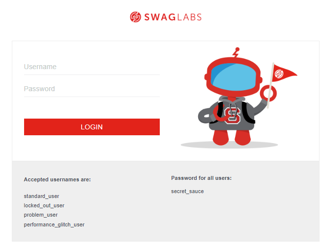
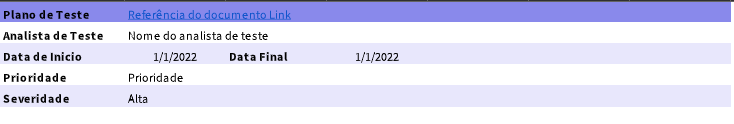
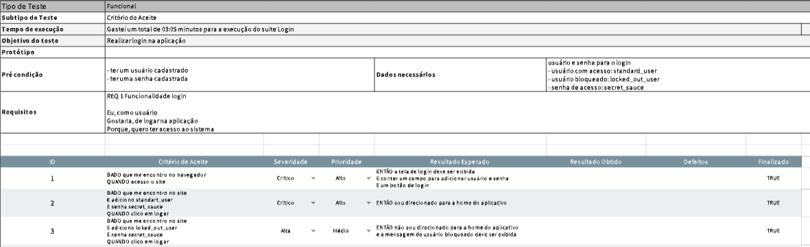

## Projeto Saucedemo

Este projeto foi criado com o propósito de práticar a criação e execução do **Plano de Teste** de um projeto, onde foi levado em consideração analisar um site já existente, realizar levantanto dos seus requisitos , criação de suites e casos de teste para execução .

## Ferramentas

- site utilizado para elaboração do Plano
  [Saucedemo](https://www.saucedemo.com/)

- Excell para criação do Plano de Teste

## Plano de Teste

### Apresentação do Plano

Na aba Introdução da Planilha irá conter todas as informações bases do projeto.

### Apresentação a Suite

Na aba Suite\_(nome do requisito) irá conter todas as informações necessárias para execução dos testes vinculados a Suíte.
Entre eles:

- Objetivo do teste:
- Tempo de execução:
- Protótipo:
- Pré condição:
- Dados necessário:
- Critério de aceite:
- Requisitos:
- Casos de teste:
- Prioridade:
- Severidade:

